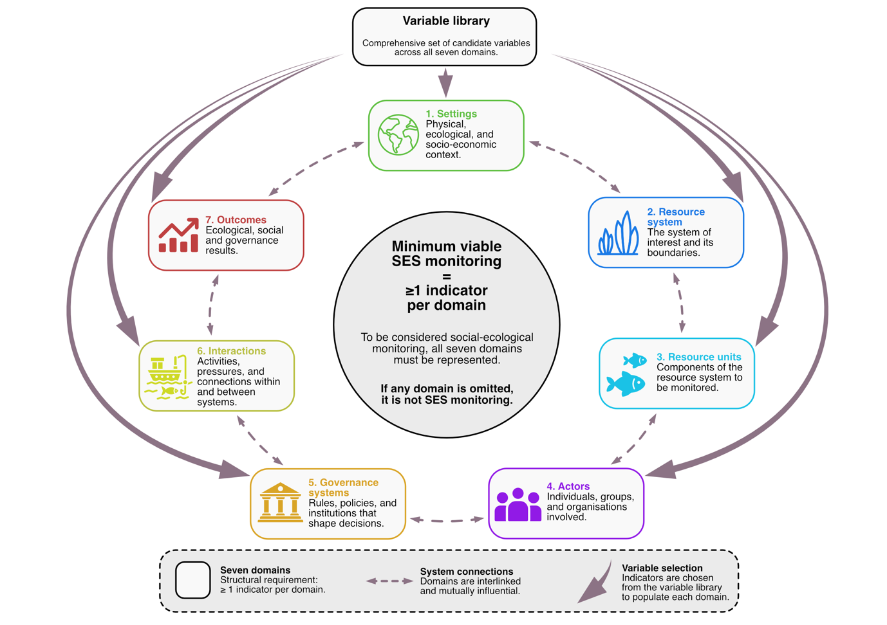

## The seven parts of a seagrass social-ecological system

This toolkit is built around seven linked parts of the system.

| Framework term | Plain-language meaning | Simple question |
|---|---|---|
| Settings | What is happening around the meadow? | What wider conditions shape this place? |
| Resource system | What is the condition of the seagrass meadow? | What is happening to the meadow itself? |
| Resource units | What does the meadow support? | What animals, resources or benefits depend on the meadow? |
| Actors | Who uses, values, manages or depends on the meadow? | Who is connected to this place? |
| Governance system | What rules, rights and institutions shape what happens? | Who makes decisions and how? |
| Interactions | What are people doing in and around the meadow? | What activities, behaviours or pressures are occurring? |
| Outcomes | What changed for nature and people? | What are the results of conservation or change? |

A monitoring plan should include at least one meaningful indicator from each domain. This is a structural rule, not a fixed global indicator list.

:::{.callout-note title="Scientific interpretation"}
The framework uses a core-plus-variable library approach. The seven-domain structure keeps monitoring social-ecological, while the indicator choices remain flexible enough for different places, interventions and capacities.
:::

## The framework

{fig-alt="Minimum viable social-ecological monitoring framework for seagrass conservation." width="100%"}

This framework helps users avoid ecology-only monitoring by asking them to consider the wider setting, the meadow, the species and benefits it supports, the people connected to it, the governance system, the interactions taking place, and the outcomes for nature and people.

## The seven domains in plain English

<h3>Settings</h3>
The wider environmental, social and economic context. This includes land use, water quality, climate exposure, market access and coastal development.

<h3>Resource system</h3>
The seagrass meadow itself: extent, cover, species composition, structure, fragmentation and visible disturbance.

<h3>Resource units</h3>
The fish, invertebrates, megafauna, nursery functions and ecosystem services supported by the meadow.

<h3>Actors</h3>
The people and groups who use, value, manage, depend on or care for the meadow.

<h3>Governance system</h3>
The rules, rights, institutions, responsibilities and decision-making processes that shape what happens.

<h3>Interactions</h3>
The activities, behaviours and pressures that connect people and seagrass, including both harmful and positive actions.

<h3>Outcomes</h3>
The changes that matter for nature and people, including ecological condition, food security, wellbeing, fairness and resilience.

:::{.callout-tip title="Practical takeaway"}
A small project can still use this framework. The aim is not to measure everything. The aim is to avoid missing an entire part of the system.
:::
